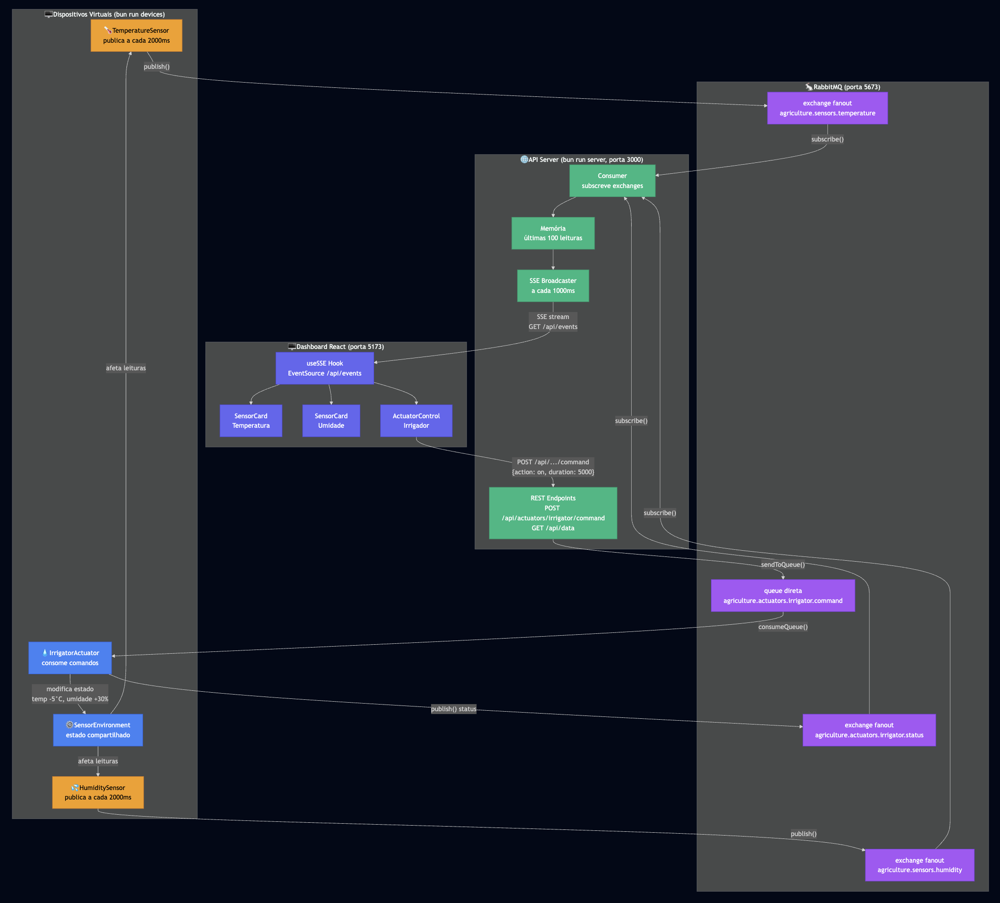
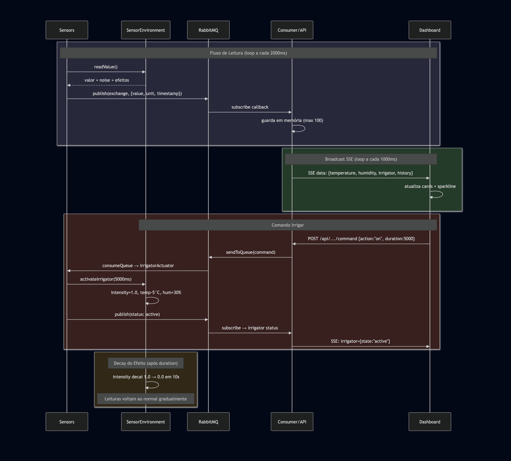

# Agriculture 4.0 - Simulador de Automação Agrícola

Simulador de ambiente de Agricultura 4.0 utilizando comunicação indireta via RabbitMQ e atualização em tempo real via Server-Sent Events. Sistema composto por sensores virtuais, atuador e painel de monitoramento web.

## Cenário Simulado

O simulador representa um ambiente agrícola automatizado com dois sensores virtuais (temperatura e umidade do solo) e um atuador (irrigador). Os sensores publicam leituras continuamente no broker RabbitMQ enquanto o atuador recebe comandos via fila dedicada.

Quando o irrigador é ativado, o sistema simula efeitos realísticos: a umidade sobe gradualmente até 100% enquanto a temperatura cai até 5°C abaixo do valor base. Após a ativação, ambos os valores retornam ao normal em aproximadamente 10 segundos (decay gradual).

Toda a comunicação acontece exclusivamente via mensagens RabbitMQ. O servidor consome essas mensagens e as transmite ao dashboard via SSE para visualização em tempo real.

## Arquitetura



## Fluxo de Dados



## Tecnologias Utilizadas

- Bun: Runtime JavaScript/TypeScript
- TypeScript: Tipagem estática
- RabbitMQ: Message broker (AMQP)
- amqplib: Cliente RabbitMQ para Node.js/Bun
- React 19: Framework frontend
- Tailwind CSS v4: Estilização
- Vite: Build tool e dev server
- SSE (Server-Sent Events): Comunicação real-time unidirecional

## Como Executar

### Pré-requisitos

- Bun instalado (https://bun.sh)
- Docker e Docker Compose

### Inicializar RabbitMQ

```bash
docker compose up -d
```

RabbitMQ estará disponível em localhost:5673 (AMQP) e localhost:15673 (Management UI).

### Executar Componentes Individuais

Sensores e Atuador:
```bash
bun run devices
```

Servidor API com Consumer SSE:
```bash
bun run server
```

Dashboard React:
```bash
bun run web
```

### Executar Tudo de Uma Vez

```bash
bun run dev
```

Isso inicia:
- Sensores publicando temperatura e umidade a cada 2 segundos
- API REST na porta 3000 com SSE em /api/events
- Dashboard React na porta 5173

### Endpoints da API

GET /api/data - Retorna estado atual dos sensores e atuador

GET /api/events - SSE stream com atualização dos dados

POST /api/actuators/irrigator/command - Envia comando ao irrigador

Exemplo de comando de irrigação:
```bash
curl -X POST http://localhost:3000/api/actuators/irrigator/command \
  -H 'Content-Type: application/json' \
  -d '{"action":"on","duration":5000}'
```

## Configuração

Todos os intervalos e parâmetros de simulação são configuráveis em src/shared/config.ts.

- Intervalos de publicação dos sensores (ms)
- Intervalo de broadcast SSE (ms)
- Efeitos do irrigador (temperatura, umidade, tempo de decay)
- URL do RabbitMQ

## Estrutura do Projeto

```
src/
├── shared/
│   ├── types.ts
│   └── config.ts
├── core/
│   └── SensorEnvironment.ts
├── broker/
│   ├── MessageBroker.ts
│   └── RabbitMQAdapter.ts
├── sensors/
│   ├── BaseSensor.ts
│   ├── TemperatureSensor.ts
│   └── HumiditySensor.ts
├── actuators/
│   ├── BaseActuator.ts
│   └── IrrigatorActuator.ts
├── server/
│   ├── consumer.ts
│   └── api.ts
├── scripts/
│   └── devices.ts
└── web/
    ├── index.html
    └── src/
        ├── main.tsx
        ├── App.tsx
        ├── index.css
        ├── hooks/
        │   └── useSSE.ts
        └── components/
            ├── SensorCard.tsx
            ├── ActuatorControl.tsx
            └── Dashboard.tsx
```

## Abstrações Reutilizáveis

BaseSensor é uma classe abstrata que pode ser estendida para criar novos tipos de sensores. Da mesma forma, BaseActuator é a base para novos atuadores. Cada novo sensor/atuador precisa apenas implementar o método abstrato de leitura/comando.

Exemplo de novo sensor:
```typescript
export class CustomSensor extends BaseSensor {
  override readValue(): number {
    return this.environment.getCustomValue();
  }
}
```

## Notas

A configuração padrão usa portas 5673 (RabbitMQ) e 15673 (Management) para evitar conflitos com containers existentes. Isso é configurável no docker-compose.yml.

StrictMode do React pode fazer o EventSource conectar duas vezes durante desenvolvimento. Isso é comportamento esperado e não afeta a funcionalidade.
# simulator-agri-mqtt
